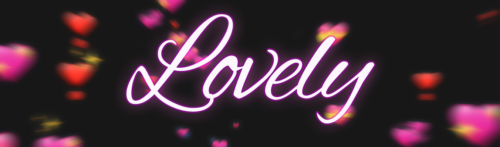

# lovely

A small project I made to play around with 2d canvases, motion blur effects and trying out canvas APIs for the first time.

## Setup, Development and Production

- Setup: `npm install`
- Development: `npm run serve`
- Build: `npm run build`